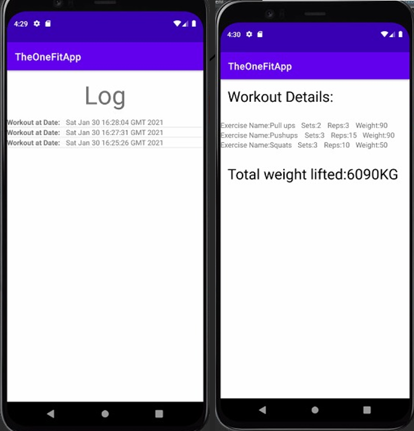

# TheOneFitApp
Fitness app where you can log custom workouts and calculate your BMI. 
Assignment for Mobile Development Class during B.Sc. studies.

## Sign-up - with validations:

## Log-in:

## Dynamic excersize creation:

## Firebase DB:

## Logging workouts:

## BMI calculator:

